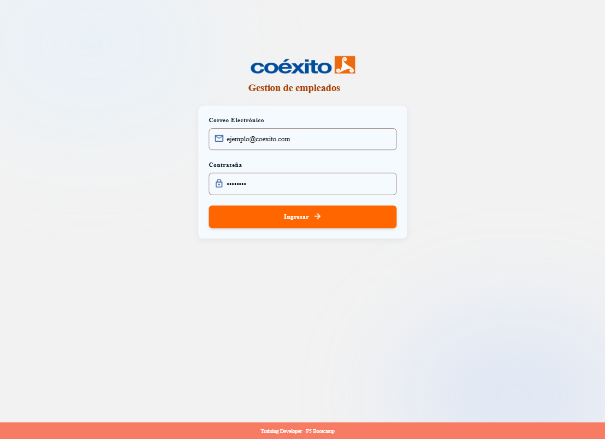
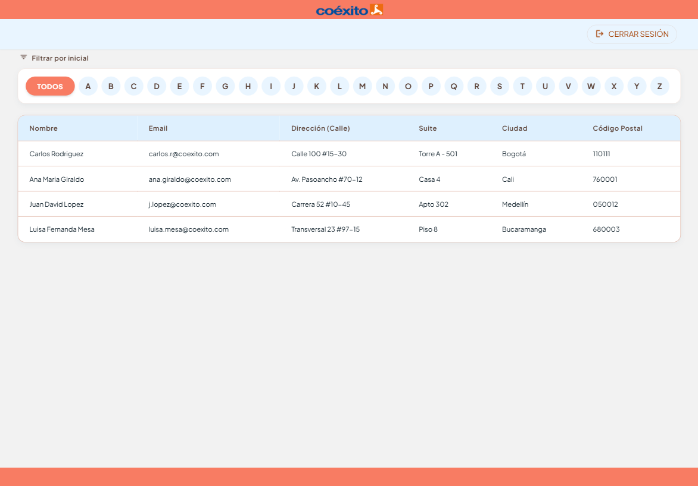
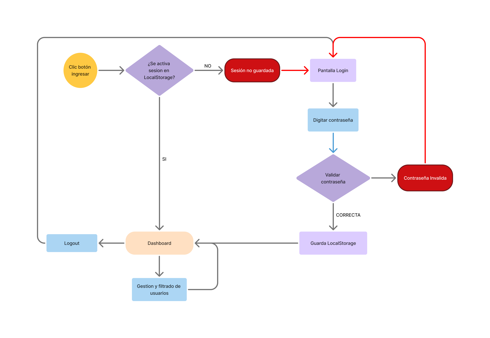
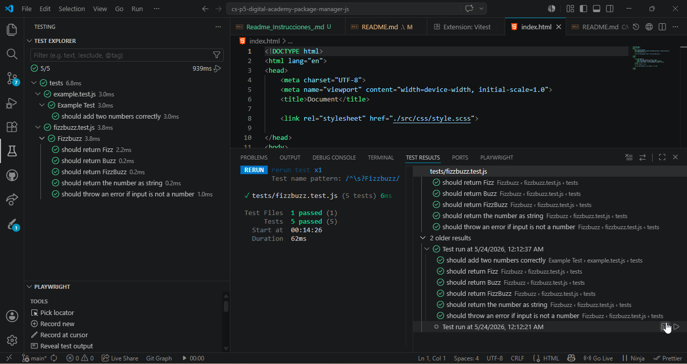
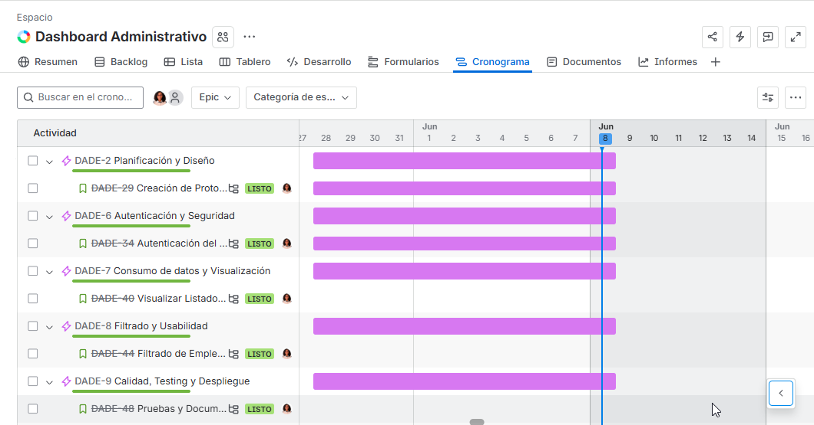
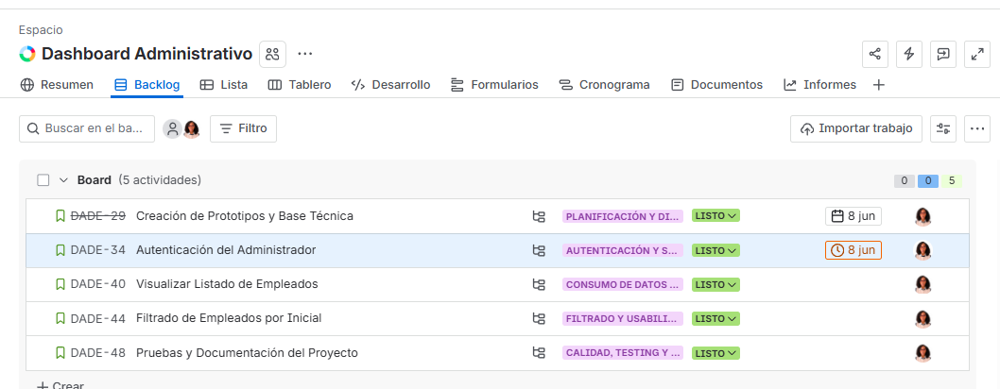

# Dashboard Administrativo de Empleados — Coéxito

##### Descripción

Aplicación web dinámica de tipo dashboard administrativo para la gestión de empleados de Coéxito.  
Permite el acceso mediante login con email y contraseña, muestra un listado de empleados obtenido desde una API externa, permite filtrarlos por la primera letra del nombre y gestiona la sesión del usuario mediante `localStorage`.

---

#### Prototipo

Capturas del prototipo diseñado en Figma/Stitch:




---

#### Userflow

El flujo de usuario de la aplicación es el siguiente:

1. El usuario hace clic en **Ingresar**
2. El sistema verifica si hay sesión activa en `localStorage`
   - **SI** hay sesión → redirige directamente al dashboard
   - **NO** hay sesión → muestra la pantalla de login
3. El usuario introduce su contraseña
4. El sistema valida la contraseña
   - **Inválida** → muestra error y vuelve al login
   - **Correcta** → guarda la sesión en `localStorage` y redirige al dashboard
5. En el dashboard el usuario puede gestionar y filtrar empleados
6. Al hacer clic en **Logout**, se elimina la sesión y vuelve al inicio



---

## Estructura de carpetas del proyecto


```text
DASHBOARD_ADMINISTRATIVO_EMPLEADOS/
├── assets/
│   ├── css/
│   │   ├── dashboard.css
│   │   ├── login.css
│   │   ├── reset.css
│   │   ├── styles.css
│   │   └── variables.css
│   ├── img/
│   │   ├── coexito.png
│   │   ├── favicon.ico
│   │   ├── logo.png
│   │   ├── Userflow.png
│   │   ├── Dashboard.png
│   │   ├── Logeo.png
│   │   ├── Cronograma_jira.png
│   │   └── Epicas_jira.png
│   └── js/
│       ├── api.js
│       ├── app.js
│       ├── dashboard.js
│       ├── session.js
│       └── validators.js
├── db/
│   └── user.json
├── Test/
│   ├── api.test.js
│   ├── filter.test.js
│   ├── session.test.js
│   └── validators.test.js
├── Dashboard.html
├── index.html
├── package.json
├── vitest.config.js
└── README.md
```

---

#### Instalación

##### Requisitos previos
- [Node.js](https://nodejs.org/) v18 o superior
- [Git](https://git-scm.com/)
- [Visual Studio Code](https://code.visualstudio.com/) con la extensión **Live Server**

#### Pasos

1. Crear prototipo en Stitch y Wireframe en Figma.
1. Crear el repositorio en GitHub
2. Clonar el repositorio en VS Code
3. Crear la estructura de carpetas
4. Agregar imágenes e iconos
5. Instalar dependencias
6. Creación de las paginas con los requerimientos.
7. Ejecución de test.

#### Ejecutar los tests

```bash
para la ejecución de los test se usó la dependencia vitest
```

---

## Tests unitarios (Vitest)

Los tests cubren las principales funcionalidades de la aplicación:

| Archivo | Funcionalidad testeada |
|---|---|
| `Test/validators.test.js` | Validación de email y contraseña |
| `Test/session.test.js` | Guardar, obtener y eliminar sesión en localStorage |
| `Test/api.test.js` | Consumo de API y estructura de datos de empleados |
| `Test/filter.test.js` | Filtrado de empleados por primera letra del nombre |

Resultado: **15 tests pasando ✅**


---

## Planificación

Proyecto gestionado con **Jira** en un sprint de 1 semana, iniciando el 28 de Mayo con fecha de entrega del 8 de Junio donde se tiene como base las siguientes epicas.
- Planificación y diseño
- Autenticación y seguridad
- Consumo de datos y visualización
- Filtrado y usabilidad
- Calidad, testing y despliegue

> Capturas del cronograma e historias de usuario en Jira:

<!-- Reemplaza estas líneas con tus imágenes -->



---

#### Historias de usuario

#### 1. Acceso al dashboard administrativo
**Como** usuario administrador  
**Quiero** acceder a un dashboard mediante email y contraseña  
**Para** poder gestionar la información de los empleados

#### 2. Listado de empleados
**Como** usuario administrador autenticado  
**Quiero** ver un listado de empleados  
**Para** consultar sus datos básicos de contacto y dirección

#### 3. Filtrado de empleados por primera letra del nombre
**Como** usuario administrador autenticado  
**Quiero** filtrar el listado de empleados por la primera letra del nombre  
**Para** encontrar más rápido a un empleado concreto

#### 4. Logout del dashboard
**Como** usuario administrador autenticado  
**Quiero** poder cerrar sesión desde el dashboard  
**Para** que nadie más pueda usar mi sesión abierta

---

#### Criterios de aceptación

#### Historia 1 — Login
- El formulario valida que el email tenga formato válido
- La contraseña debe tener mínimo 8 caracteres y al menos un dígito
- Si las credenciales son correctas, redirige al dashboard
- Si hay sesión activa, redirige automáticamente al dashboard sin pasar por el login

#### Historia 2 — Listado de empleados
- Se muestran los empleados obtenidos de `https://jsonplaceholder.typicode.com/users`
- Cada empleado muestra: nombre, email, calle, suite, ciudad y código postal
- Se muestra un mensaje de carga mientras se obtienen los datos
- Se muestra un mensaje de error si la API falla

#### Historia 3 — Filtrado por letra
- Se muestran botones de la A a la Z y un botón "TODOS"
- Al hacer clic en una letra, el listado se actualiza mostrando solo los empleados cuyo nombre empiece por esa letra
- Si no hay resultados, se muestra un mensaje informativo

#### Historia 4 — Logout
- El botón de cerrar sesión elimina la sesión de `localStorage`
- Tras el logout, redirige al login
- Si se intenta acceder al dashboard sin sesión, redirige al login

---

#### Tecnologías utilizadas

- HTML5
- CSS3
- JavaScript Vanilla
- Vitest (testing unitario)
- Git + GitHub + GitHub Pages

---

#### 👩🏻‍💻Autora

**Luisa María Cortes**  
[GitHub](https://github.com/lcortes89)

---
Training Developer · F5 Bootcamp
